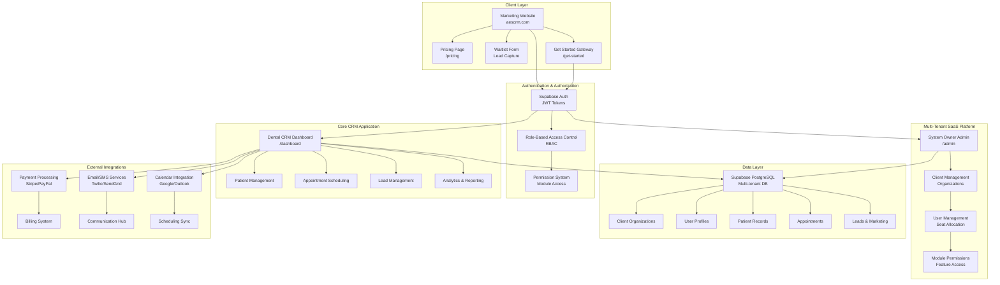
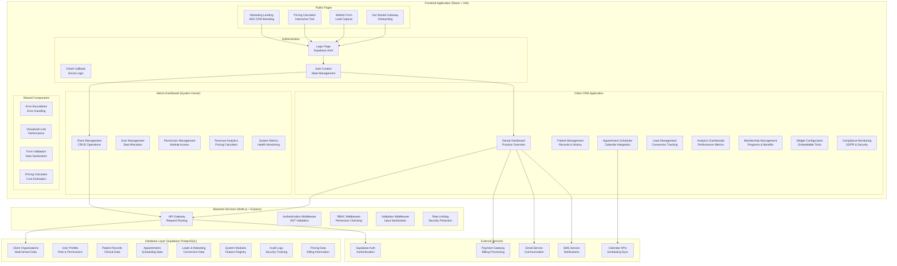
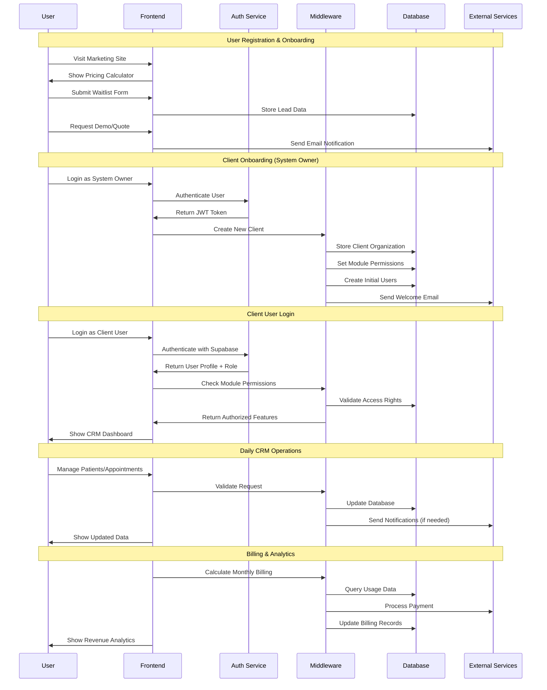
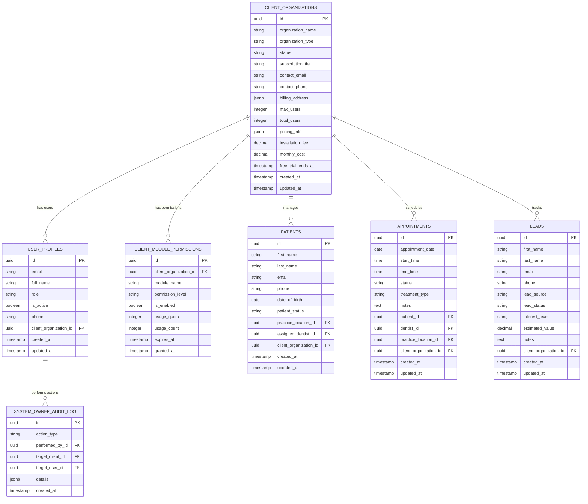
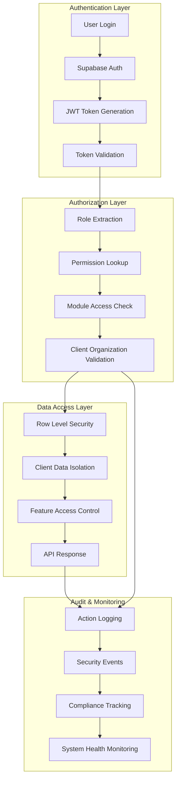
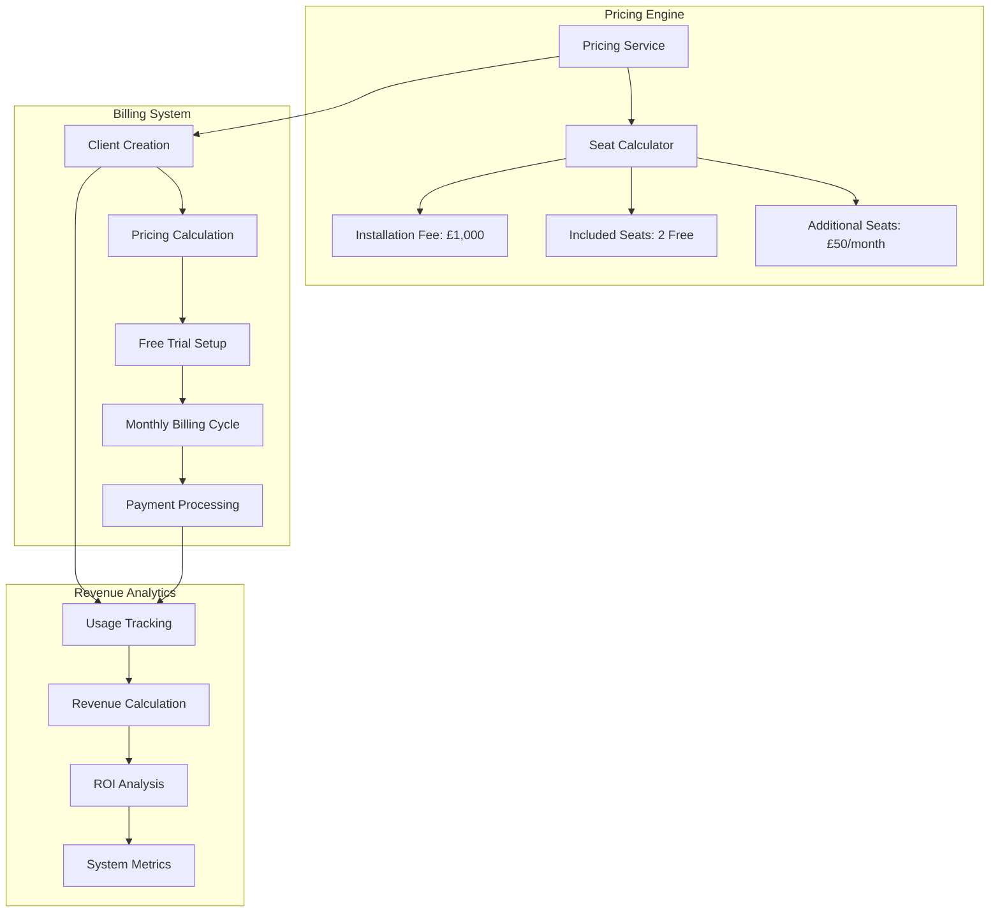
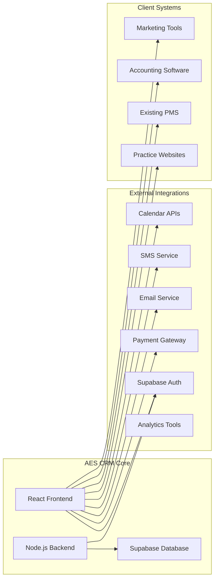
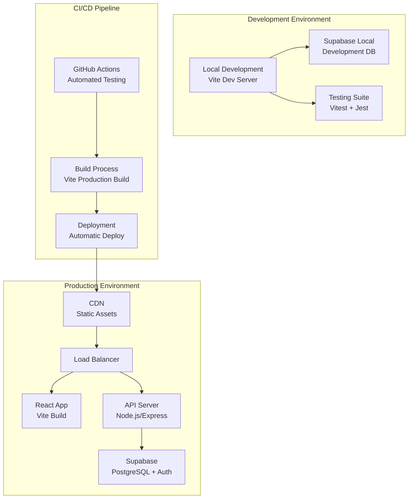

# AES CRM System Architecture

## High-Level System Overview

## Detailed Component Architecture

## Data Flow Architecture

## Multi-Tenant Data Architecture

## Security & Access Control Flow

## Pricing & Billing Architecture

## Integration Points

## System Deployment Architecture

## Key Integration Points

1. **Authentication**: Supabase Auth with JWT tokens
2. **Database**: PostgreSQL with Row Level Security
3. **Payments**: Stripe/PayPal integration
4. **Communications**: Email/SMS services
5. **Scheduling**: Calendar API integrations
6. **Analytics**: Built-in reporting and external tools
7. **Multi-tenancy**: Client data isolation
8. **Security**: RBAC, audit logging, encryption

This architecture provides a scalable, secure, and maintainable SaaS platform for dental practices with comprehensive client management capabilities.
